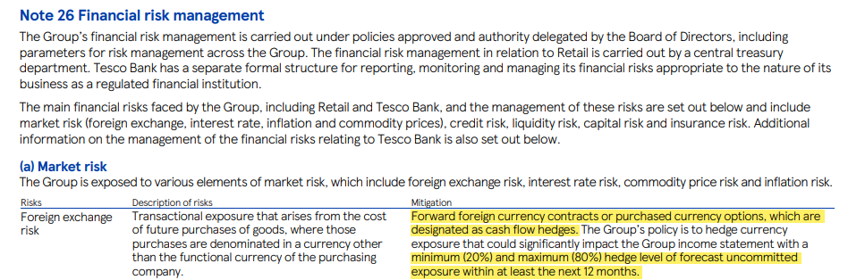
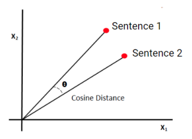

# FX Hedging Strategy Data Mining

_*This is a NUS Capstone Project in collaboration with [NatWest Markets](https://www.natwest.com/corporates.html)._

## Problem Statement

When businesses transact in various currencies (anticipate costs in one currency and revenue in another), this creates a risk to their business when the exchange rate moves as it may worsen their profit margins by making their costs larger relative to their revenues. To mitigate their exposure to exchange rate moves, many businesses need to execute currency / foreign exchange (FX) hedges through the use of financial derivatives products such as forwards and options. 

Information on companies' FX hedging strategies is typically available in the public domain, through their annual reports. However, sourcing this information manually is very time consuming as a typical annual report is 200 pages (approximately 3000-4000 sentences) long on average. Carrying out this process on a wider scale will be extremely tedious.

Therefore, the aim of this project is to extract and present data on the FX hedging strategies of UK corporates through the use of machine learning techniques, which would serve to empower NatWest’s conversations with their UK corporate customer base. 

<kbd>  

## Text Extraction with Cosine Similarity

Cosine similarity is a metric used to measure how similar two documents are, irrespective of their size. Mathematically, it measures the cosine of the angle between two vectors projected in a multi-dimensional space. The cosine similarity score will be close to 1 (ie. angle close to 0°) for two similar vectors and close to 0 (ie. angle close to 90°) for two different vectors.

<kbd>  

Each sentence in an annual report will be checked against a repository matrix, which contains hedging-related sentences, to determine whether that particular sentence contains information relevant to hedging (ie. is relevant). This will be done by calculating the angle between the input sentence vector and all the sentence vectors within the repository matrix, returning a list of angles. An input sentence vector whose smallest angle is below the given threshold (ie. 50°) will be predicted as relevant, otherwise it will be predicted as irrelevant. In essence, if an input sentence is very similar to at least one sentence within the repository
matrix, it will be deemed as a relevant sentence.

For this project, sentences will be vectorized using this particular transformer model called the _[all-MiniLM-L12-v2](https://www.sbert.net/docs/pretrained_models.html#sentence-embedding-models/)_, which can be loaded using the SentenceTransformers library.

## Data

`data/input/parsed_text` - Annual reports parsed into sentences 

`data/output/relevant_text` - FX hedging-related sentences extracted from the parsed annual reports

`data/repository.csv` - 256 FX hedging-related sentences manually extracted from 57 annual reports, used to create the repository matrix

## Built With

 - [scikit-learn](https://scikit-learn.org/stable/) 
 - [SentenceTransformers](https://www.sbert.net/) - Python framework for state-of-the-art sentence, text and image embeddings. 
 - [Pandas](https://pandas.pydata.org/) 
 - [Numpy](https://numpy.org/) 
